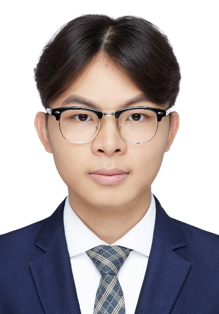

## About me

I'm **Jen-tse Huang (黃任澤)**, a final-year undergraduate student at Peking University, majoring in computer science at Yuanpei College. Also, I'm a research intern at SenseTime Research Beijing. I'm interested in machine learning and computer vision, specifically in generative algorithms, representations learning. **I am going to pursue my Ph.D study in Hong Kong.**

## Experience

- *2015.09 - 2019.07*, **Undergraduate**, [Peking University](https://www.pku.edu.cn/)

  Major in Computer Science at [Yuanpei College](https://yuanpei.pku.edu.cn/)

- *2018.02 - Current*, **Research Intern**, [SenseTime Research Beijing](https://www.sensetime.com/)

  Mentor: Chen Qian [(Google Scholar)](https://scholar.google.com.hk/citations?user=AerkT0YAAAAJ)

- *2018.11 - Current*, **Research Intern**, [Joint Lab of SenseTime and MMLab CUHK](http://mmlab.ie.cuhk.edu.hk/)

  Mentor: Bolei Zhou [(Personal Homepage)](http://bzhou.ie.cuhk.edu.hk/), [(Google Scholar)](https://scholar.google.com.hk/citations?user=9D4aG8AAAAAJ)

- *2018.11 - Current*, **Research Intern**, [STRUCT, Peking University](http://www.icst.pku.edu.cn/struct/)

  Mentor: Jiaying Liu [(Personal Homepage)](http://www.icst.pku.edu.cn/struct/people/liujiaying.html), [(Google Scholar)](https://scholar.google.com/citations?user=-OcSne0AAAAJ)

## Contact me

Mail: hrz@pku.edu.cn

Github: https://github.com/penguinnnnn

Skype Name: live:hrzpenguin